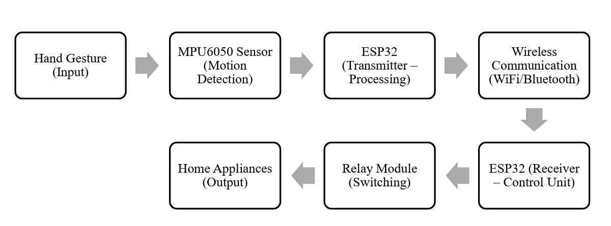
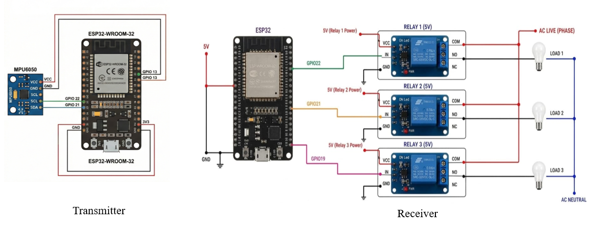
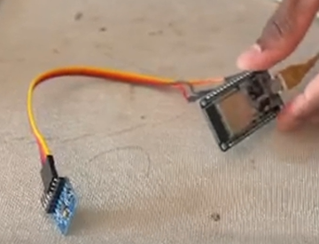
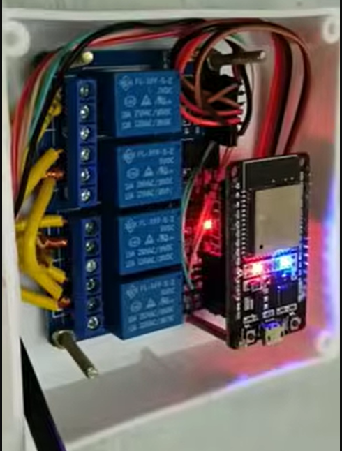

# Gesture-Controlled Wireless Home Automation System

## Overview

This project is an ESP32-based wireless home automation system that allows electrical appliances to be controlled using predefined hand gestures.

The system uses an MPU6050 motion sensor to detect hand movement and tilt. The gesture information is processed by an ESP32 transmitter and sent wirelessly to a receiver ESP32 using the ESP-NOW communication protocol. The receiver then controls electrical appliances through relay modules.

## My Contribution

- Designed the overall ESP32-based system architecture.
- Developed the transmitter and receiver firmware using Arduino IDE.
- Interfaced the MPU6050 motion sensor with ESP32 using I2C.
- Implemented gesture detection using pitch and roll measurements.
- Implemented ESP-NOW communication between the transmitter and receiver ESP32.
- Integrated relay control for switching multiple appliances.
- Tested and debugged the wireless communication and gesture-based control.

## System Architecture

Hand Gesture
      ↓
MPU6050 Sensor
      ↓
ESP32 Transmitter
      ↓
ESP-NOW Wireless Communication
      ↓
ESP32 Receiver
      ↓
Relay Module
      ↓
Home Appliances

## Block Diagram

## Circuit Diagram

## Project Hardware

## Hardware Components

- ESP32 DevKit × 2
- MPU6050 Motion Sensor
- 3-Channel Relay Module
- 5V Power Supply
- Electrical Loads / Bulbs
- Connecting Wires

## Software & Technologies

- Arduino IDE
- Embedded C/C++
- ESP32
- MPU6050
- ESP-NOW
- I2C
- Wireless Communication
- Relay Control

## Working Principle

1. The MPU6050 measures the motion and tilt of the hand.
2. The transmitter ESP32 reads the sensor data through I2C.
3. The programmed gesture logic identifies the predefined gesture.
4. The corresponding command is transmitted using ESP-NOW.
5. The receiver ESP32 receives the command.
6. The receiver controls the appropriate relay.
7. The relay switches the connected electrical appliance.

## Gesture Control

| Gesture | Appliance |
|---------|-----------|
| Forward Tilt | Appliance 1 |
| Backward Tilt | Appliance 2 |
| Right Tilt | Appliance 3 |

## Features

- Wireless appliance control
- Gesture-based operation
- ESP32-to-ESP32 communication
- ESP-NOW wireless protocol
- MPU6050 motion sensing
- Multiple appliance control
- Real-time relay switching

## Applications

- Smart Home Automation
- Assistive Control Systems
- IoT Automation
- Wireless Appliance Control

## Results

- Successfully implemented wireless communication between two ESP32 boards using ESP-NOW.
- Integrated MPU6050-based gesture detection for appliance control.
- Implemented gesture-based switching of multiple electrical loads through relay modules.
- Tested transmitter and receiver operation as a two-node wireless system.
- Demonstrated real-time response to predefined tilt-based gestures.

## Project Demo

🎥 [Watch the Gesture-Controlled Home Automation Demo on YouTube](https://youtube.com/shorts/ShCPz-nK8F4)

## Future Improvements

- Web-based control dashboard
- Mobile application integration
- Additional gesture commands
- Improved gesture recognition
- Appliance status feedback

## Project Files

- `transmitter.ino` - ESP32 transmitter code
- `receiver.ino` - ESP32 receiver code
